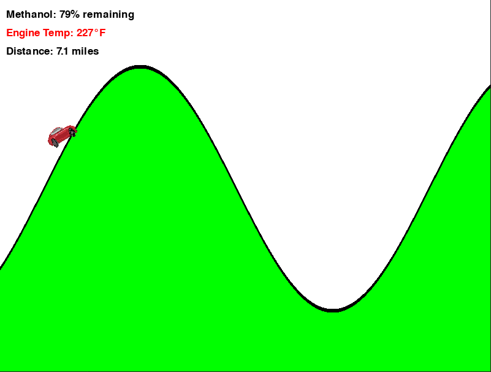

# Water Methanol Injection Hill Climb

Welcome to Water Methanol Injection Hill Climb! This is a quick demonstration game created to showcase the benefits of water/methanol injection and its most useful application for heat extraction in automotive engines.

## Requirements

pip install pygame

## Controls

- **Spacebar**: Activate water/methanol injection to cool the engine

## Demo Mechanics

In this game, the car's engine idles at 195 degrees Fahrenheit and overheats once it reaches 230 degrees. When climbing hills, your car will build heat, and you can inject water/methanol to cool it down. However, when descending downhill, the car will not build heat, but it also will not cool below the minimum temperature of 195 degrees. Keep in mind that although you can cool the engine down to 170 degrees, most engines typically only allow this due to heat soak.

## Bugs

Please note that this demonstration is not perfect. If you encounter any issues or anomalies during gameplay, it's best to exit and restart the game for a clean and fresh run.

Enjoy playing and exploring the benefits of water/methanol injection in automotive engines!

